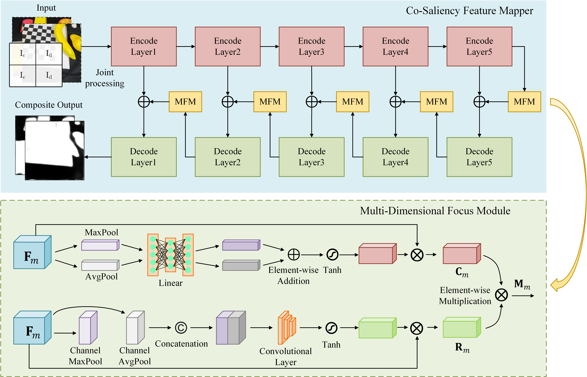

# CSSGNet: Co-Saliency Space Guidance Based Visual Servoing 

Code for paper CSSGNet: Co-Saliency Space Guidance Based Visual Servoing 

## Environment
The environment used in the revised manuscript is Python 3.9, PyTorch 2.7.0, CUDA 12.7, and CoppeliaSim 4.7.0.

## Others
Backbone initialization weights:
vs: https://drive.google.com/file/d/1NlewlbAEbBgJ1P10gD-NzdgajElogsHA/view?usp=drive_link
cosal: https://drive.google.com/file/d/1VDTqbkra4KtkB2WDT92JZfo8KGxmKJPu/view?usp=drive_link